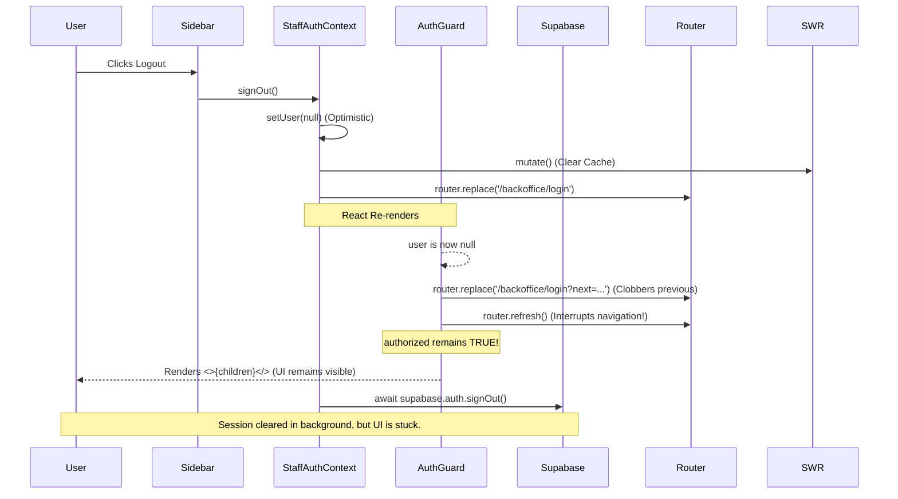

# Phase UX-1A — Logout UX Root Cause Audit

## 1. Current Logout Flow Diagram

## 2. Files Involved
- `src/contexts/StaffAuthContext.tsx` (Initiates logout, optimistic state updates)
- `src/components/backoffice/AuthGuard.tsx` (Route protection, handles null user state)

## 3. State Transition Timeline
1. `StaffAuthContext.signOut()` sets `user` state to `null` synchronously.
2. `StaffAuthContext` calls `router.replace("/backoffice/login")`.
3. React re-renders the component tree because context state changed.
4. `AuthGuard` detects `!user`.
5. `AuthGuard` calls `router.replace(...)` again.
6. `AuthGuard` calls `router.refresh()` immediately after.
7. `AuthGuard`'s render function executes. Since `authorized` is a state variable initialized to `false` but previously set to `true` on login, it remains `true`.
8. `AuthGuard` returns `<>{children}</>`, keeping the protected dashboard mounted.
9. `supabase.auth.signOut()` executes asynchronously in the background.

## 4. Root Cause
The root cause is a combination of **State Management**, **Router Conflict**, and **Race Conditions**.
- **Critical Root Cause 1 (State Management):** `AuthGuard` never sets `authorized = false` when `user` becomes `null`. Thus, it continues rendering the protected UI instead of hiding it.
- **Critical Root Cause 2 (Router Conflict):** `AuthGuard` calls `router.refresh()` immediately after `router.replace()`. In the Next.js App Router, calling `refresh()` synchronously with `replace()` interrupts and cancels the client-side navigation, causing the app to remain on the current route.
- **High Root Cause 3 (Race Condition):** `StaffAuthContext` attempts to navigate *before* awaiting `supabase.auth.signOut()`. Even if navigation succeeded, if the server components were refreshed, they might still see the old session cookie.

## 5. Why refresh fixes the problem
When the user presses F5 to manually refresh the browser, it forces a hard reload. By this time, the asynchronous `supabase.auth.signOut()` has finished and deleted the local session cookies. Upon reload, `AuthGuard` initializes with `authorized = false`, sees no user session, and successfully executes a clean `router.replace` to the login page without rendering the protected UI.

## 6. Which component still thinks the user is logged in
**`AuthGuard`** still thinks the user is authorized to view the UI because its internal `authorized` state remains `true`, even though it acknowledges that `user` is `null`.

## 7. Which cache still contains old data
- The **Next.js Client-Side Router Cache** preserves the old page because the navigation was interrupted by `router.refresh()`. 
- The **SWR Cache** does NOT contain old data (it was successfully cleared by `mutate(() => true, undefined, { revalidate: false })`), which is why the stuck UI might sometimes show loading skeletons or empty states if a child component re-renders.

## 8. Which component should trigger the redirect
**`StaffAuthContext`** should trigger the redirect AFTER successfully clearing the Supabase session, ensuring a clean state. `AuthGuard` should act as a fallback, but it must hide the UI immediately by setting `authorized = false`.

## 9. Categorization of the Issue
- **Authentication**: No (Supabase correctly ends the session).
- **State Management**: **YES** (`AuthGuard` fails to reset `authorized` state).
- **SWR**: No (SWR cache is cleared correctly).
- **Router**: **YES** (Conflicting `replace` and `refresh` calls).
- **Middleware**: No (This project does not use Next.js middleware; it relies on `AuthGuard`).
- **React Rendering**: **YES** (Sync state updates causing UI to remain mounted).

## 10. Estimated Complexity
**Low to Medium**. The fix requires reordering the logout sequence in `StaffAuthContext` (await sign out, then route) and correcting the state logic + removing `router.refresh()` in `AuthGuard`. No major architectural changes are needed.

READY FOR UX-1 FIX
